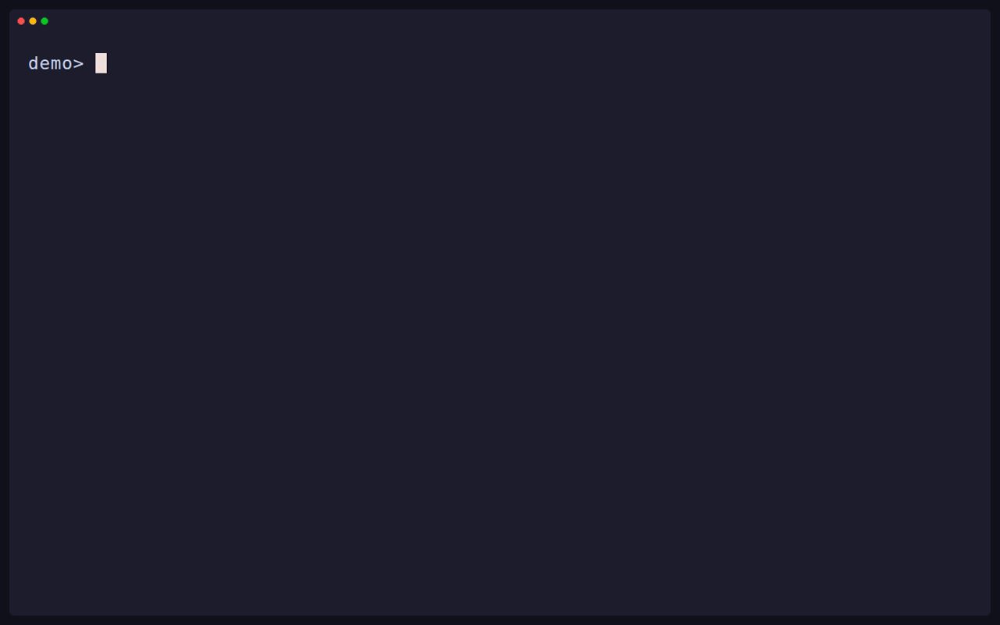

---
relationships:
  describes: toha
---

# Toha

Generate projects and files from templates.

[](https://github.com/wyrd-company/toha/actions/workflows/ci.yml?query=branch%3Amain)
[](https://github.com/wyrd-company/toha/releases/latest)



Toha is a project scaffolding tool and Rust crate. A template contains an
interview and files to render with Jinja. Toha plans the output before it
writes, so you can inspect a dry run and handle conflicts.

The same interview engine serves terminal users, scripts, agents, and Rust
callers. Scripts and agents can answer one JSON Schema batch at a time and
resume a staged interview in another process.

- One interview for people, scripts, agents, and Rust callers
- Resumable async interviews and headless answers files
- Typed Jinja values and rendered file paths
- `each` file generation and static files
- Template hooks gated by trust
- Git template sources, short names, and aliases
- Embedded agent skills through `toha skills`

Read the [Toha documentation](https://wyrd.tools/docs/toha) for guides and the
full contract.

## Install

Homebrew:

```sh
brew install wyrd-company/tools/toha
```

APT:

```sh
sudo install -d -m 0755 /etc/apt/keyrings
curl -fsSL https://repo.wyrd.foo/pubkey.asc |
  sudo tee /etc/apt/keyrings/wyrd-company.asc >/dev/null
echo "deb [signed-by=/etc/apt/keyrings/wyrd-company.asc] \
https://repo.wyrd.foo/apt stable main" |
  sudo tee /etc/apt/sources.list.d/wyrd-company.list >/dev/null
sudo apt update
sudo apt install toha
```

RPM:

```sh
sudo curl -fsSL https://repo.wyrd.foo/wyrd.repo -o /etc/yum.repos.d/wyrd.repo
sudo dnf install toha
```

Arch Linux (AUR):

```sh
paru -S toha-bin
```

[GitHub Releases](https://github.com/wyrd-company/toha/releases/latest) also
provides Linux and macOS tarballs, Windows zip archives, and `SHA256SUMS` for
direct installation.

## First run

From a checkout of this repository, use the
[demo template](docs/examples/demo/template.yml):

```sh
toha apply ./docs/examples/demo ./notes
```

Answer **Note title** and **Topic**. To inspect the file plan without writing
it, use `toha apply ./docs/examples/demo ./preview --dry-run`.

## Using Toha from Rust

Add the library without the CLI dependencies:

```sh
cargo add toha --no-default-features
```

From this repository checkout, drive the same interview with a JSON answers
document:

```rust
use std::path::Path;
use toha::{Interview, Seed, Template, protocol};
let template = Template::load(Path::new("docs/examples/demo")).unwrap();
let seed = Seed { now: "2026-01-01T00:00:00Z[UTC]".parse().unwrap(), defaults: Default::default() };
let Interview::Asking(pending) = Interview::start(&template, seed).unwrap() else { panic!("expected questions") };
let answers = protocol::parse_answers(r#"{"title":"Sample note","topic":"Research"}"#).unwrap();
let Interview::Complete(done) = pending.answer(answers).unwrap() else { panic!("expected complete interview") };
assert_eq!(done.answers.len(), 2);
```

See [CONTRIBUTING.md](CONTRIBUTING.md) for development and changes.
